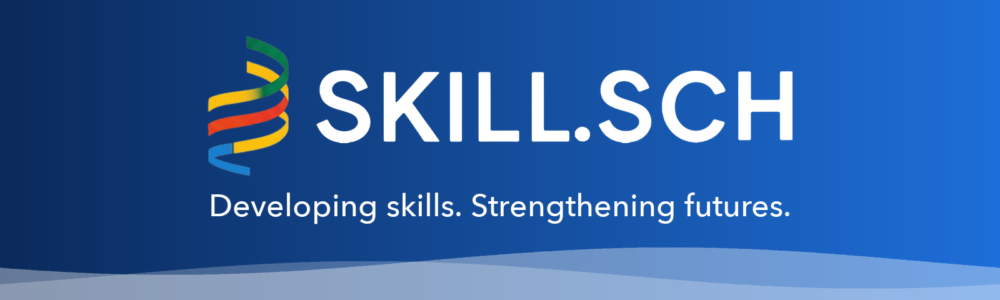

  AI-powered training in Cloud, DevOps, Data, and AI, with live mentorship and real-world projects that get you hired.

  <a href="https://skill-sch.com">Website</a> ·
  <a href="https://skill-sch.com">Browse courses</a> ·
  <a href="https://skill-sch.com">Scholarship</a> ·
  <a href="mailto:info@skill-sch.com">Contact</a>

---

## What we do

SKILL.SCH trains the next generation of cloud and platform engineers through hands-on labs, simulated work environments, and mentor-led cohorts.

| | |
|---|---|
| **CloudLabs** | Guided hands-on labs for AWS, Azure, GCP, Linux, and DevOps |
| **SSlab Engine** | Simulated internships where learners complete real technical projects and earn verified skill scores |
| **Learning Arcade** | Games and simulations that build muscle memory for Docker, security, and multi-cloud decisions |
| **Resume Studio** | AI-assisted resume writing for tech roles |
| **Partner Portal** | Connects learners with hiring partners and real-world projects |

## Learning path

1. **Foundation**: cloud fundamentals and core concepts (2–4 weeks)
2. **Specialization**: go deep on Azure, AWS, or GCP (6–8 weeks)
3. **Real projects**: production-ready builds for your portfolio (8–12 weeks)
4. **Certification**: prepare for official cloud certifications (2–4 weeks)
5. **Career growth**: ongoing mentorship, community, and career support

## Popular programs

- **Cloud DevOps Engineer**: Azure and AWS tracks plus DevOps fundamentals and deep dive (26 weeks)
- **DevOps Deep Dive**: CI/CD, Kubernetes, and infrastructure as code
- **Azure Administrator Associate (AZ-104)**
- **Kubernetes Administrator (CKA)**
- **Docker Certified Associate (DCA)**
- **GitLab DevOps Mastery**: GitOps, CI/CD pipelines, and DevSecOps

See all programs at [skill-sch.com](https://skill-sch.com).

## Open source

| Repository | What it is |
|---|---|
| [paid-tech-writing](https://github.com/skillsch/paid-tech-writing) | Link-checked list of companies that pay developers to write technical articles |

## Get involved

- **Learners**: start at [skill-sch.com](https://skill-sch.com)
- **Graduates**: start at [joinsslabs.com](https://joinsslabs.com)
- **Hiring partners and corporate training**: [info@skill-sch.com](mailto:info@skill-sch.com)
